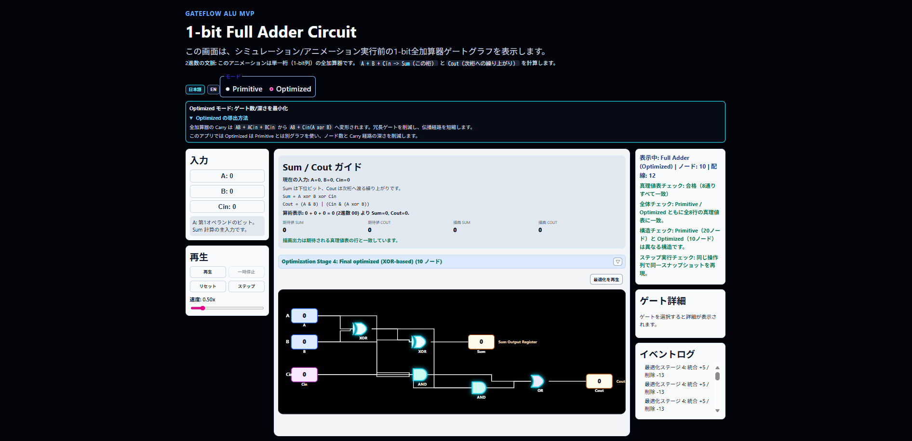
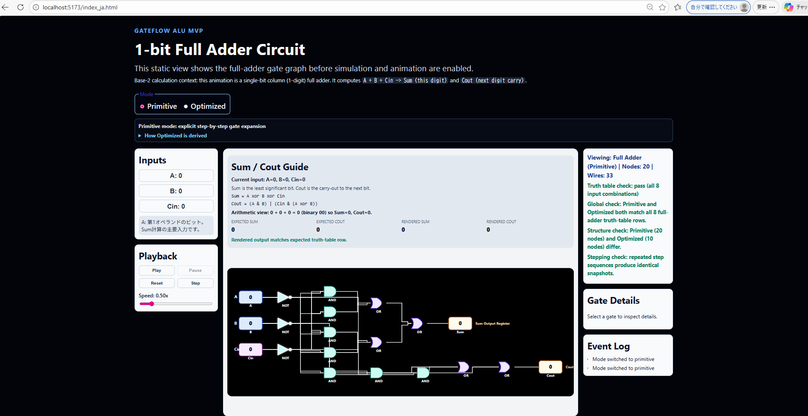
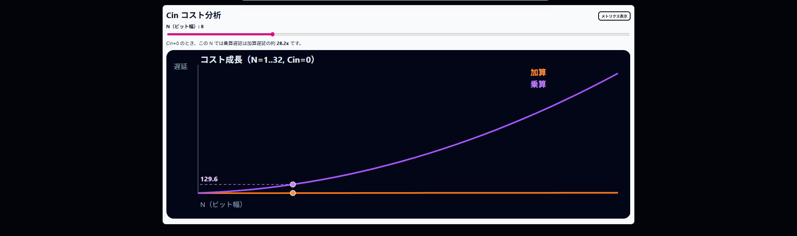

# GateFlow ALU

GateFlow ALU is an educational web app that visualizes a **1-bit full adder** at gate level with interactive simulation.

## Demo / Screenshots

### Main View


### Additional Views




### Demo GIF (optional)
> Add your GIF at `./docs/images/gateflow-demo.gif` if needed.

---

## 日本語 (Japanese)

### 概要
GateFlow ALU は、**1-bit 全加算器**の動作を論理ゲートレベルで可視化する学習用Webアプリです。  
入力 `A`, `B`, `Cin` を切り替え、`Sum`, `Cout` の変化や信号伝播をアニメーションで確認できます。

### 主な機能
- 1-bit Full Adder の入力: `A`, `B`, `Cin`
- 出力: `Sum`, `Cout`
- `Primitive` / `Optimized` の2モード（**別々の回路グラフ**）
- MIL風論理記号による回路表示（SVG）
- 信号ドット、アクティブ配線/ゲートのハイライト
- 再生コントロール: Play / Pause / Reset / Step
- 再生速度調整
- ゲート詳細パネル
- イベントログ
- `ja/en` 言語切替 UI
- Cin Cost Insight（遅延・イベント数・曲線表示）

### クイックスタート
必要環境:
- Node.js 18+（推奨: LTS）
- npm

```bash
npm install
npm run dev
```

ブラウザで以下へアクセス:
- `http://localhost:5173/`

本番ビルド:
```bash
npm run build
npm run preview
```

### 使い方
1. `Inputs` パネルで `A/B/Cin` をクリックして値を切り替える  
2. `Playback` で再生、停止、ステップ実行を行う  
3. 回路上のゲートをクリックして `Gate Details` を確認する  
4. `Primitive/Optimized` を切り替えて、回路構造と最適化段階を比較する  
5. ヘッダーの `日本語 / EN` ボタンでUI言語を切り替える

### 注意
- このリポジトリのMVPは **1-bit Full Adder に限定** されています。
- 4-bit回路、追加ALU演算、永続化、バックエンドはMVP範囲外です。

---

## English

### Overview
GateFlow ALU is an educational app for exploring a **1-bit full adder** at the gate level.  
You can toggle `A`, `B`, and `Cin`, then observe how `Sum` and `Cout` propagate through the circuit.

### Features
- 1-bit full adder inputs: `A`, `B`, `Cin`
- Outputs: `Sum`, `Cout`
- Two modes: `Primitive` and `Optimized` (**distinct circuit graphs**)
- SVG renderer with MIL-style gate symbols
- Animated signal dots and active wire/gate highlighting
- Playback controls: Play / Pause / Reset / Step
- Speed control
- Gate details panel
- Event log panel
- `ja/en` language switcher
- Cin Cost Insight (delay/events metrics + curve view)

### Quick Start
Requirements:
- Node.js 18+ (LTS recommended)
- npm

```bash
npm install
npm run dev
```

Open:
- `http://localhost:5173/`

Production build:
```bash
npm run build
npm run preview
```

### How to Use
1. Toggle input bits in the `Inputs` panel (`A/B/Cin`)
2. Use `Playback` controls to run, pause, reset, or step
3. Click gates in the circuit to inspect details
4. Compare `Primitive` vs `Optimized` circuit structures and optimization stages
5. Switch UI language with `日本語 / EN` in the header

### Scope Note
The MVP intentionally focuses on **1-bit full adder visualization** only.  
No 4-bit circuits, extra ALU operations, backend, or persistence are included.

---

## Project Structure

```text
src/
  app/         # status messages and app-level helpers
  circuits/    # circuit graph definitions (primitive / optimized / stages)
  simulation/  # event-driven logic simulation engine
  renderer/    # SVG wire routing and rendering helpers
  components/  # React UI + panels + circuit viewport
  types/       # shared TypeScript types
```
